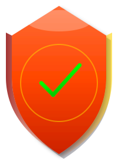

<p align="center">
  
</p>

<h1 align="center">ModerationKit</h1>

<p align="center"><i>Local Nudity Detector — self-hosted, two-model offline stack</i></p>

[](LICENSE)
[](https://www.python.org)
[](Dockerfile)
[](https://gradio.app)
[](README.md)
[]()

> **Two-model offline stack for image moderation.** Body-part detector + whole-image NSFW classifier, combined into a single ALLOW/REVIEW/BLOCK verdict. Built for self-hosting. No API calls, no per-image cost, no images leave your machine.

| Model | Job | Note |
|---|---|---|
| **NudeNet 640m** | Body-part detector with bounding boxes | Larger variant from upstream releases — not the bundled nano |
| **Falconsai/nsfw_image_detection** | Whole-image NSFW classifier | Used as the primary verdict signal — no gender bias |
| **CombinedAnalyzer** | Stacks both, resolves conflicts, applies bias compensation | The novel part |

## Why this exists

NudeNet alone is the most-used free open-source body-part detector, but it has two well-known problems: (1) it was trained on a female-skewed dataset so male anatomy detections score 3× lower than equivalent female detections, and (2) it sometimes hallucinates the wrong-gender class confidently in the same region. Most "free NSFW detector" projects ship NudeNet raw with a single threshold and call it done — those false positives and false negatives quietly slip through.

This project layers the following on top:
- **Male-anatomy score boost** (default 2.5×) to compensate for the training bias at the application layer
- **Cross-class conflict resolution** — when contradictory detections (e.g. `FEMALE_BREAST` and `MALE_GENITALIA`) overlap heavily, drop both and defer to the whole-image classifier
- **Whole-image classifier as primary verdict signal** — the gender-biased detector is downgraded to a "what specifically" annotation source
- **Production-ready FastAPI server** with env-var-tunable thresholds, ALLOW/REVIEW/BLOCK verdicts, fail-closed integration examples for 4 stacks
- **Pulls the larger NudeNet model** (`640m.onnx`, 104 MB) from upstream releases instead of the tiny `320n.onnx` (12 MB) the pip package ships

## What's in the box

| Component | What it does |
|---|---|
| `app.py` | Gradio web UI for manual testing |
| `server.py` | FastAPI HTTP service that other apps call |
| `detector.py` | NudeNet wrapper (with our own pre/post-processing) |
| `nsfw_classifier.py` | Falconsai whole-image classifier wrapper |
| `analyzer.py` | Combines both models, resolves conflicts, computes verdict |
| `batch.py` | CLI for scanning a folder of images |
| `integrations/` | Ready-to-paste examples for Node, Next.js, Django, Laravel |

## Quickstart with Docker (recommended)

One command, all dependencies bundled, models pre-downloaded:

```bash
git clone https://github.com/YOUR_USERNAME/moderationkit.git
cd moderationkit
docker compose up
```

That's it. You now have:
- API at `http://localhost:8000` (for your app to call) — see `/docs` for Swagger
- UI at `http://localhost:7860` (for humans to test)

First build is ~5 minutes (downloads dependencies, both models). Subsequent starts are seconds.

## Quickstart without Docker

You need Python 3.10 or newer.

**Windows**
```
install.bat        # one-time setup, downloads ~550 MB of dependencies + models
run.bat            # launches the web UI at http://127.0.0.1:7860
run-server.bat     # launches the moderation API at http://127.0.0.1:8000
run-share.bat      # public *.gradio.live URL valid ~72h, no install needed for users
```

**macOS / Linux**
```bash
chmod +x install.sh run.sh run-server.sh run-share.sh
./install.sh
./run.sh           # web UI
./run-server.sh    # moderation API
```

## Use as an API

The `/check` endpoint takes a multipart image upload and returns a verdict:

```bash
curl -X POST http://127.0.0.1:8000/check -F "file=@your_image.jpg"
```

Response:
```json
{
  "verdict": "BLOCK",
  "reason": "Whole-image NSFW score 0.93 >= 0.7",
  "nsfw_score": 0.9341,
  "explicit_detections": [
    {"class": "MALE_GENITALIA_EXPOSED", "score": 0.6051, "box": [302, 145, 275, 247]}
  ],
  "elapsed_ms": 482
}
```

See [integrations/README.md](integrations/README.md) for full integration examples in Node.js, Next.js, Django, Laravel, and PHP.

## Publish your own copy

### Option 1 — GitHub (source distribution)

```bash
cd E:\Claude\NudityDetection
git init
git add .
git commit -m "Initial commit"
git branch -M main
git remote add origin https://github.com/YOUR_USERNAME/nudity-detector.git
git push -u origin main
```

The `.gitignore` already excludes the model file — `download_models.py` fetches it on first install. Anyone who clones the repo runs `install.bat` and gets a working setup.

### Option 2 — Hugging Face Spaces (free public hosting)

This gets you a **public URL** plus an **API endpoint** anyone can use, on Hugging Face's free CPU tier. No credit card required.

1. Sign up at https://huggingface.co (free)
2. Click **"New Space"** → name it (e.g. `nudity-detector`) → SDK: **Gradio** → CPU basic (free)
3. Clone your new empty Space:
   ```bash
   git clone https://huggingface.co/spaces/YOUR_USERNAME/nudity-detector
   cd nudity-detector
   ```
4. Copy these files into the cloned Space directory:
   - `README.md` (the YAML frontmatter above is what HF uses for config)
   - `app.py`, `detector.py`, `nsfw_classifier.py`, `analyzer.py`
   - `download_models.py`, `requirements.txt`
5. Add a startup hook so the model downloads on first launch — create `pre-build.sh`:
   ```bash
   #!/usr/bin/env bash
   python download_models.py
   ```
6. Push:
   ```bash
   git lfs install
   git add .
   git commit -m "Initial deploy"
   git push
   ```
7. HF builds the Space (~3–5 minutes). When it's ready, your URL is `https://huggingface.co/spaces/YOUR_USERNAME/nudity-detector`.

**Free tier limits:**
- Sleeps after ~48 hours of inactivity → cold start ~30–60 seconds
- 16 GB RAM, 2 vCPU — plenty for this workload
- Public URL anyone can hit

**Calling the public API** — Gradio Spaces auto-expose API endpoints. From any Python:

```python
from gradio_client import Client
client = Client("YOUR_USERNAME/nudity-detector")
result = client.predict(
    image="path/to/image.jpg",
    api_name="/analyze",
)
print(result)  # the verdict + scores
```

From any other language, hit `https://YOUR_USERNAME-nudity-detector.hf.space/api/predict` with a POST body — the `/docs` page on the Space shows the exact schema.

### Option 3 — Self-hosted VPS (production)

For production at scale, deploy `server.py` to a $5/mo VPS:
- DigitalOcean, Hetzner, Linode all work
- Use `systemd` to keep `uvicorn server:app --host 0.0.0.0 --port 8000` running
- Put nginx in front for HTTPS
- See [integrations/README.md](integrations/README.md) for a Dockerfile

## Why nothing free exists publicly

Three reasons, in order of importance:

1. **Compute costs money.** Every image = CPU/GPU time. A free public API would get hammered.
2. **NSFW content has hosting policy issues.** Most cloud platforms (Vercel, Netlify, Render) don't want public NSFW APIs running on their infrastructure.
3. **Liability.** Public NSFW APIs invite testing of edge-case content. Hosts avoid the legal exposure.

That's why every "easy" option you found (Sightengine, Hive, AWS Rekognition) is paid.

The closest things to free public hosting are:
- **Hugging Face Spaces** (this repo's Option 2 above) — designed for ML demos, allows NSFW models, free CPU tier
- **Self-hosting** — each user runs it on their own machine

## Verdict semantics

The combined analyzer outputs one of three verdicts based on tunable thresholds:

| Verdict | Meaning | What your app should do |
|---|---|---|
| `ALLOW` | Both models agree it's safe | Save / publish the image |
| `REVIEW` | Borderline — one signal flagged | Save but mark for human moderation |
| `BLOCK` | Either model is highly confident it's NSFW | Reject the upload |

Default thresholds:
- BLOCK if Falconsai NSFW ≥ 0.70 OR detector explicit score ≥ 0.50
- REVIEW if Falconsai NSFW ≥ 0.30 OR detector explicit score ≥ 0.20
- Otherwise ALLOW

Tunable via env vars or the UI's "Verdict policy (advanced)" panel. See [integrations/README.md](integrations/README.md) for the env-var table.

## Responsible use — please read before deploying

**This tool is for legitimate adult-content moderation only** (18+ platforms, profile-picture gating, dating apps, content filtering, internal moderation pipelines). It is open-source, offered as-is, and you take full legal and ethical responsibility for how you deploy it.

### What this tool does NOT do

- **Does NOT detect Child Sexual Abuse Material (CSAM).** This is critical. NudeNet and Falconsai are trained to recognize adult anatomy generically and cannot reliably distinguish between an adult and a minor. **If your platform allows user-uploaded images, you legally must integrate a CSAM-specific service.** Use one of:
  - [Microsoft PhotoDNA Cloud Service](https://www.microsoft.com/en-us/photodna) — free for qualifying platforms
  - [Thorn Safer](https://safer.io/) — paid, more comprehensive
  - [NCMEC CyberTipline reporting](https://report.cybertip.org/) — required by US law
  - [INHOPE](https://www.inhope.org/) — international equivalents
- **Does NOT moderate text, video, audio, or links.** Image only.
- **Does NOT replace human review** for borderline content. Use the `REVIEW` verdict to queue ambiguous images for a human moderator.

### Operational requirements

- **Add a clear ToS** stating that uploads are scanned, what you do with rejected content, and how appeals work
- **Log every BLOCK + REVIEW decision** for audit. The API response includes `model_versions` for reproducibility
- **Treat false positives as a UX problem.** Have an appeal flow. Tune thresholds with sample data from your specific platform.
- **Do not deploy as a fully public API on shared infrastructure** without rate limits and abuse mitigation. Run on your own machine for your own platform.

### Bias notice

NudeNet has documented training-data bias toward female anatomy. We compensate at the application layer, but no amount of postprocessing fully fixes a biased model. If your platform serves a diverse user base, **test sample images across demographics before shipping** and tune the `male_score_boost` parameter accordingly.

## Known limitations

- **NudeNet has female-skewed training data.** Male anatomy detections score ~3× lower than female. The analyzer compensates with a `male_score_boost` multiplier (default 2.5×).
- **No `MALE_GENITALIA_COVERED` class.** Bulges in tight clothing aren't detected by the box-detector. The whole-image classifier picks up most such cases via overall composition signals.
- **Free HF Space sleeps after 48h inactivity.** First request after sleep takes ~30s to wake.
- **Not perfect.** No free model is. Run sample images for your specific use case and tune thresholds before shipping.

## License

MIT — see [LICENSE](LICENSE). Third-party models retain their original licenses (NudeNet weights, Falconsai Apache-2.0).

## Credits

- [NudeNet](https://github.com/notAI-tech/NudeNet) — body-part detector
- [Falconsai/nsfw_image_detection](https://huggingface.co/Falconsai/nsfw_image_detection) — whole-image classifier
